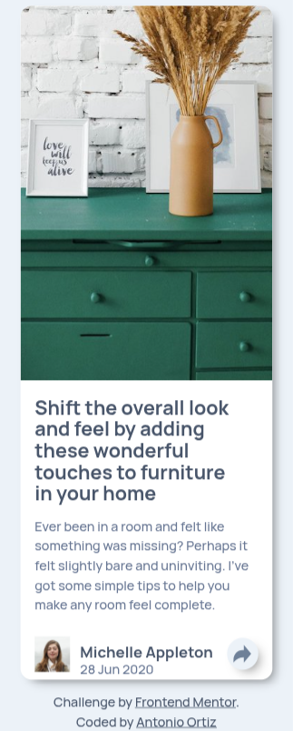

# Frontend Mentor - Article Preview Component solution

This is a solution to the Article Preview Component challenge on Frontend Mentor. Frontend Mentor challenges help you improve your coding skills by building realistic projects. 

## Table of contents

- [Overview](#overview)
  - [The challenge](#the-challenge)
  - [Screenshot](#screenshot)
  - [Links](#links)
- [My process](#my-process)
  - [Built with](#built-with)
  - [What I learned](#what-i-learned)
  - [Continued development](#continued-development)
- [Author](#author)

## Overview

### The challenge

Users should be able to:

- View the optimal layout for the site depending on their device's screen size

### Screenshot

### Links

- Solution URL: [Frontend Mentor](https://www.frontendmentor.io/profile/)
- Live Site URL: [GH Pages](https://ortiz-antonio.github.io/article-preview-component)

## My process

### Built with

- Semantic HTML5 markup
- CSS custom properties
- Flexbox
- CSS Grid
- Typescript
- Progresive Enhancement

### What I learned

I practice progressive enhancement. I don't show the button if the browser doesn't have JavaScript enabled and display the menu by default.

### Continued development

I will continue learning about progressive enhancement, and I will improve my design tokens as well as my utility classes.

## Author

- Website - 
- Frontend Mentor - [@](https://frontendmentor.com/profile/ortiz-antonio)
